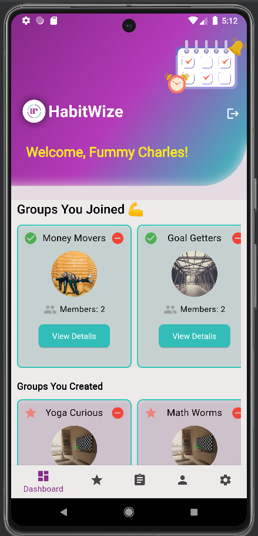
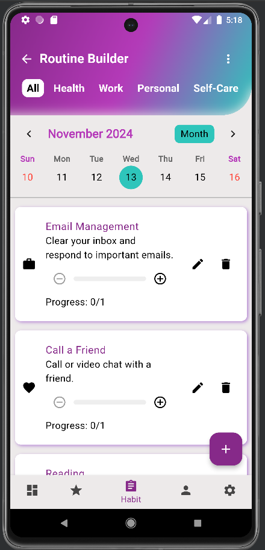
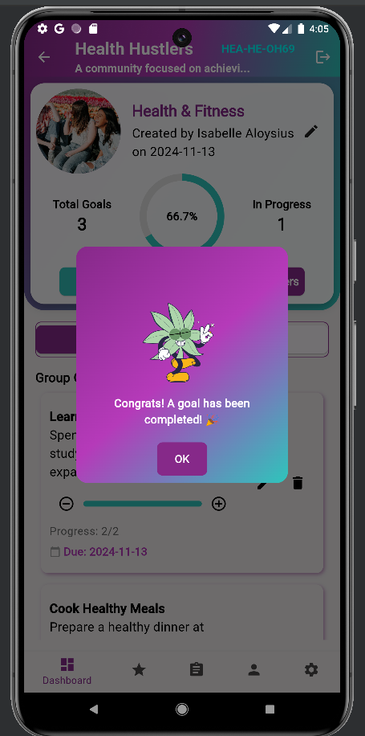
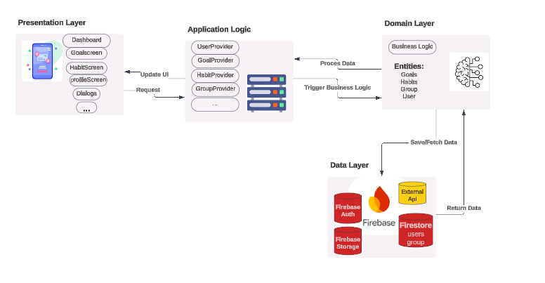

# HabitWise  

  
*Empowering Consistency, Together!*  

## Table of Contents  
- [Overview](#overview)  
- [Features](#features)  
- [Screenshots](#screenshots)  
- [Architecture](#architecture)  
- [Setup Instructions](#setup-instructions)  
- [Technologies Used](#technologies-used)  
- [Future Enhancements](#future-enhancements)  
- [Contributing](#contributing)  
- [License](#license)  

---

## Overview  
**HabitWise** is a habit and goal-tracking app designed to help users develop positive habits and achieve personal or group goals. Combining simplicity and accountability, HabitWise ensures that users stay motivated and consistent in their journey to success.  

---

## Features  
### Currently Implemented  
- **Individual Goals and Habits**:  
  Monitor personal goals and habit progress.  
- **Group Goals**:  
  Collaborate and stay accountable with group members.  
- **User Stats**:  
  Automatic tracking of completed goals and habits.  
- **Celebratory Messages**:  
  Motivational prompts for achievements.  

### Planned Features  
- **Habit Streaks**: Track consecutive habit completions.  
- **Gamification**: Earn rewards and badges for milestones.  
- **Custom Notifications**: Never miss a habit or deadline.  

---

## Screenshots  

### 1. Personal Habit Tracking  
  
*View progress and stay on top of your goals.*  

### 2. Group Collaboration  
  
*Work with your team to achieve shared goals.*  

---

## Architecture  


_HabitWise leverages Flutter for cross-platform UI, Firebase for backend services, and Provider for state management._  

---

## Setup Instructions  

### Prerequisites  
- [Flutter SDK](https://docs.flutter.dev/get-started/install)  
- [Firebase Setup](https://firebase.google.com/docs/flutter/setup)  

### Steps  
1. **Clone the repository**:  
   ```bash
   git clone https://github.com/Elizbeh/habitwise.git  
   cd habitwise  

### Install Dependencies  
To set up and run the app, follow these steps:  

1. **Install project dependencies**:  
   ```bash
   flutter pub get

### Set up Firebase  
To configure Firebase for your app:  

1. **Add Firebase configuration files**:  
   - Place the `google-services.json` file in the `android/app` directory (for Android).  
   - Place the `GoogleService-Info.plist` file in the `ios/Runner` directory (for iOS).  

2. **Run the app**:  
   ```bash
   flutter run

### Technologies Used  
- **Flutter**: Cross-platform framework for UI development.  
- **Firebase**: Backend services for database, authentication, and analytics.  
- **Provider**: State management for modular and scalable architecture.  

---

### Future Enhancements  
We plan to add the following features to improve the app:  
- **Recurring Habit Tracking**: Allow users to track daily, weekly, and monthly habits.  
- **Leaderboards**: Introduce leaderboards to encourage friendly competition among users.  
- **Group Messaging**: Enable better collaboration through real-time messaging for group goals.  
- **Advanced Analytics**: Provide detailed insights into user habits and goal progress.  

### Contributing  
We welcome contributions to improve HabitWise! Follow these steps to contribute:  

1. **Fork the Repository**:  
   Click the "Fork" button at the top-right corner of this repository to create your own copy.  

2. **Clone the Repository**:  
   ```bash  
   git clone https://github.com/Elizbeh/habitwise.git 

### Steps to Contribute  

1. **Navigate to the Project Directory**:  
   After cloning the repository, navigate to the project folder:  
   ```bash
   cd habitwise
2. **Create a New Branch**:  
   After cloning the repository, navigate to the project folder:  
   ```bash
   git checkout -b feature-name
3. **Make Your Changes:**:
  Implement your changes or add new features to the app.
4. **Commit Your Changes**:
  Write a clear and concise commit message:
  ```bash
  git commit -m "Add feature-name"
5. **Push to Your Branch**:
  Write a clear and concise commit message:
  ```bash
  git push origin feature-name

5. **Submit a Pull Request**:
  Open a pull request on the original repository and provide a detailed description of your changes.
